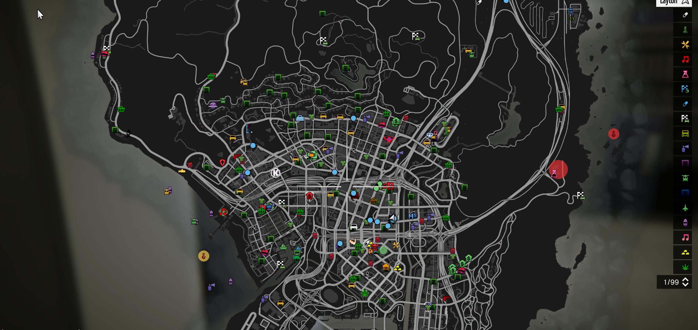

# Long-Range Emergency Blips

## License Cost: <mark style="color:blue;">£5,000,000</mark>

The license itself is pretty self expanatory, it just allows you to be able to see blips from any range (MPS-NHS-HMP-LFB-AdvancedGangLicense. (Blue dots are for MPS)-Refrence image

<figure><figcaption>
Long-Range Emergency Blips
</figcaption></figure>
