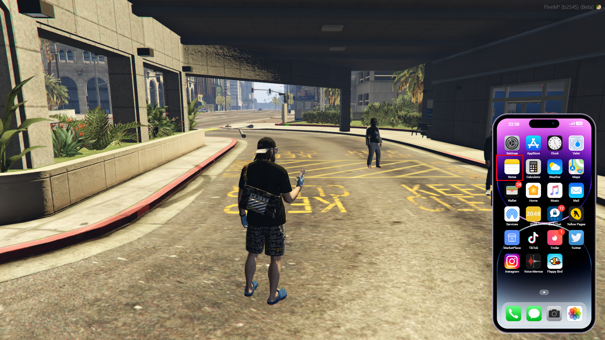
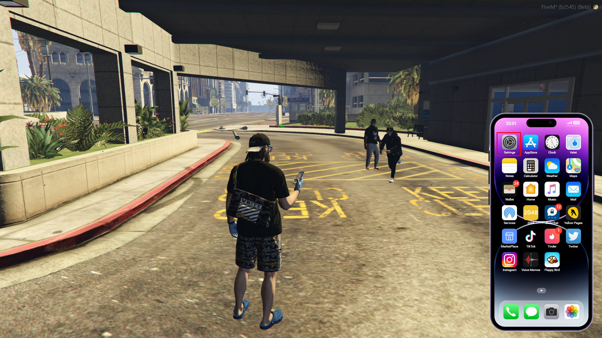
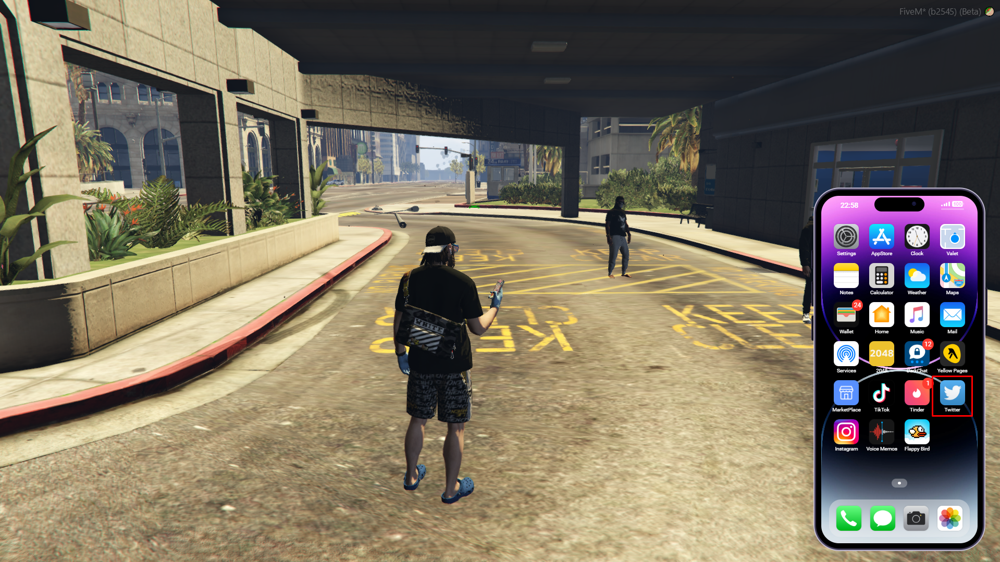
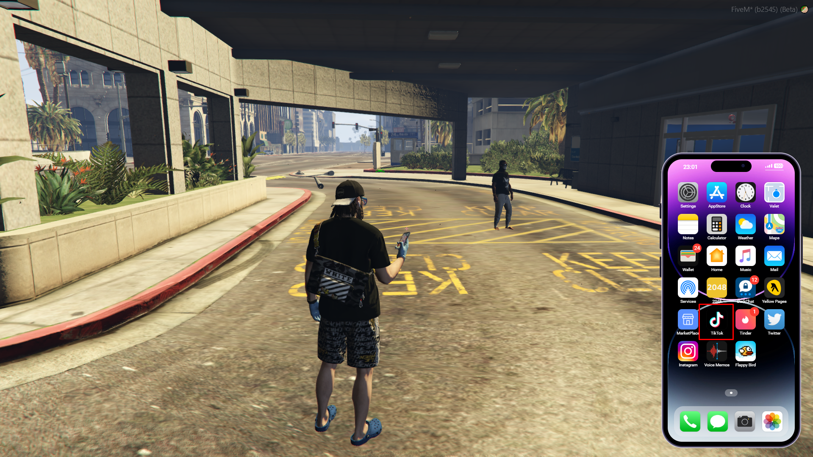

# 📲 CMG PHONE

## CMG phone (updated-2023):

The phone on cmg everyone automatically has by default, which is a permanent non physical item that other players can not steal. The key bind to open the phone is <mark style="color:blue;">K.</mark> Shown in the image below.

<figure><figcaption>
Phone opened by pressing K
</figcaption></figure>

 

<figure><figcaption></figcaption></figure>

Once you've opened the <mark style="color:blue;">phone</mark>, there's multiple applications that you can use and download from the app store just like a normal iphone in real life. Shown in the image below.

<figure><figcaption></figcaption></figure>

 

<figure><figcaption></figcaption></figure>

### You can use the phone to call other people, add people to your contacts, send money and more!

You can use the <mark style="color:blue;">camera</mark> to take pictures around the city, whilst also having the ability to take selfies and send them via messages to your friends and also to share them on instagram, twitter, tiktok etc...

With <mark style="color:blue;">messages</mark> you can obviously message people and send images, you can also send money via messages. Shown in the image below

<figure><figcaption></figcaption></figure>

<mark style="color:blue;">Notes</mark> This is used to make any notes that you might want to make on your phone. Shown in the image below.

<figure><figcaption></figcaption></figure>

 

<figure><figcaption></figcaption></figure>

The <mark style="color:blue;">settings</mark> are used to change different settings on your phone such as wallpapers, ringtones, do not disturb etc. Shown in the image below.

<figure><figcaption></figcaption></figure>

 

<figure><figcaption></figcaption></figure>

The <mark style="color:blue;">valet</mark> is a perk that you gain if you have CMG PLATINUM, which you can purchase off other players ingame or off the store. Shown in the image below.

<figure><figcaption></figcaption></figure>

 

<figure><figcaption></figcaption></figure>

With the <mark style="color:blue;">twitter</mark> app this is used to make posts images and text that can bee seen by other players. Shown in the image below.

<figure><figcaption></figcaption></figure>

 

<figure><figcaption></figcaption></figure>

With the <mark style="color:blue;">instagram</mark> app this is used to make posts images and text that can bee seen by other players. Shown in the image below.

<figure><figcaption></figcaption></figure>

 

<figure><figcaption></figcaption></figure>

With the <mark style="color:blue;">tiktok</mark> app this is used to make posts images and text that can bee seen by other players.\
Shown in the image below.

<figure><figcaption></figcaption></figure>

 

<figure><figcaption></figcaption></figure>

### How to add a contact:

After you have their phone number and name, you can go to your phone contacts app and add them as a contact by opening your phone and going to the "contacts app" and then press the + in the top right hand corner and put their phone number and name. You can also find your phone number and name at the top of the list, shown in the image below.

<figure><figcaption></figcaption></figure>

 

<figure><figcaption></figcaption></figure>

### How to send money

Once you have the person added as a contact, you can then send them money via messages by selecting the dollar symbol at the bottom middle of your messages. Or you can send money via the wallet app also. Shown in the image below.

<figure><figcaption></figcaption></figure>

 

<figure><figcaption></figcaption></figure>

 

<figure><figcaption></figcaption></figure>

### How to use the camera

Once you have the camera app open it'll show a pop up on the top left hand side of your screen which tells you how to use the camera. Shown in the image below.

<figure><figcaption></figcaption></figure>

Once you've taken a picture it'll appear in your photo album which you would be able to find / see just like a normal iphone in real life which you can post on instagram/twitter/tiktok etc... Shown in the image below.&#x20;

<figure><figcaption></figcaption></figure>

 

<figure><figcaption></figcaption></figure>

