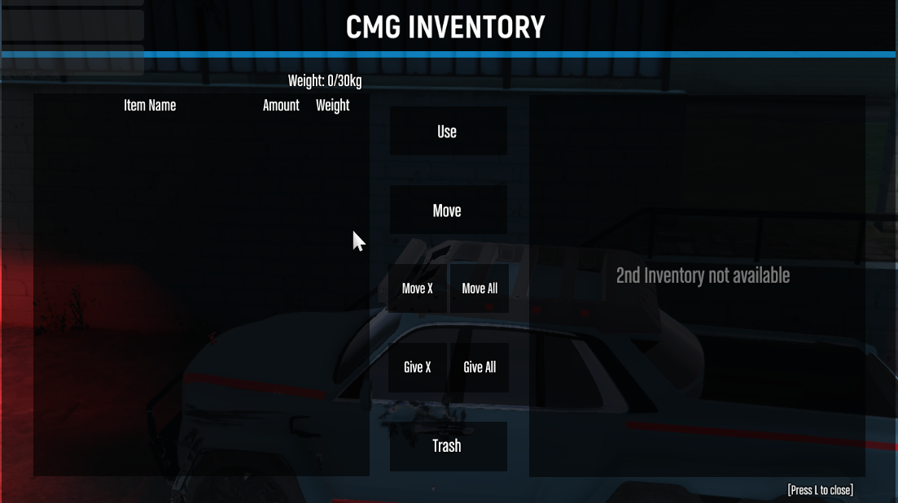
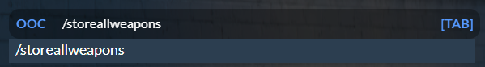
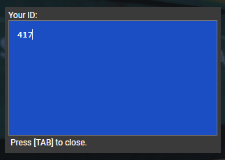

# 🗒 FAQ

#### <mark style="color:blue;">Where can i report someone ?</mark> <mark style="color:blue;">:</mark>                                                                                                                                 You can either report a player by doing /calladmin ingame, or via the cmg forums [`https://cmgstudios.net/forums/index.php?/forum/12-report-a-player/`](https://cmgstudios.net/forums/index.php?/forum/12-report-a-player/)  <mark style="color:blue;">**Where can i appeal my ban ? :**</mark> You can appeal your ban via the forums [`https://cmgstudios.net/forums/index.php?/forum/10-unban-appeal/`](https://cmgstudios.net/forums/index.php?/forum/10-unban-appeal/)  <mark style="color:blue;">**AA**</mark>: -Be clocked on (City Hall) -Go claim your two FREE aa vehicles from simeons -You can buy repair kits from the AA compound near mission row -You can take calls via \` or the phone whichever shows the calls now -To tow a vehicle you need to press E on your AA truck then go over the to be towed vehicle then press E on it then it should appear on your Flat-bed or on your Hook -To repair a vehicle you can claim "repair kits" from the AA compound, then they'll be in your inventory which you can see via pressing L and then if you go over to a broken car you can press E on it then select "repair vehicle" on the radial menu. -AA Recently has just been added a automatic paycheck system thanks to @Tom!

<mark style="color:blue;">**Dirty cash**</mark>:\
You can buy a burner phone at any store ingame for 500k , and then it'll be in your inventory which you can see via pressing <mark style="color:blue;">**L**</mark>. Which then you can press on the phone and then press "use" it'll set a waypoint where you need to meet the cleaner. The time it takes to clean the money depends on the amount of money you want to clean. you can store the burner phone in a car or house whilst it's not being used and you can and will lose the burner phone on death if you do have it in your player inventory.

<mark style="color:blue;">**Car garage menu not popping up**</mark>:\
If you're on a car spawner and the menu is not popping up, this is due to the fact that it is a <mark style="color:blue;">**VIP**</mark>: car garage that requires the supporter rank + purchasing the supporter rank, gives you access to alot more car spawners / garages around the map, and a new respawn location known as "vip island", you also get a 500k money bag along with being able to choose a vip car of your choice ingame via the /store menu.

<mark style="color:blue;">**"Steam account not found"**</mark>:\
The reason this message appears when you try to join the server is because your steam account is an identifier for the server (to detect ban evaders / cheaters etc...), to fix this issue, you must close fivem fully, then go and open your steam fully (you must have an account), then you can launch fivem again whilst still having steam fully open and you'll be able to join the server perfectly fine. (It does not matter which launcher you have gta purchased on whether it's epic games, steam or the rockstar launcher, you just have to follow the steps above).

<mark style="color:blue;">**Server appearing offline but showing online in the #status section of the discord**</mark>:\
If the server is appearing offline whilst it's not meant to (only times the server should appear offline is during the daily restart at 10am which takes about 15-25 minutes), if you open your f8 console whilst having fivem open and paste in the servers connect, and paste the following <mark style="color:blue;">**"connect s1.cmg.city"**</mark>:

<mark style="color:blue;">**Unable to connect to the server ?**</mark>:\
A couple of causes of this could result in fivem being down (happens frequently) which you can check the status of fivem via this link <mark style="color:blue;">**https://status.cfx.re/**</mark>:. Or the actual CMG server is down having maintenence, they're fixing something important, or the dedicated machine is having issues which you can check via this link. <mark style="color:blue;">**"https://status.cmgstudios.net/"**</mark>:

<mark style="color:blue;">**Stuck beneath the map ?**</mark>:\
If you're stuck under the map, try the following commands which should work and teleport you above the map. <mark style="color:blue;">**/unstuck**</mark>: / <mark style="color:blue;">**/reset**</mark>: , if neither work do <mark style="color:blue;">**/calladmin**</mark>: and wait for them to take your ticket. (Bare in mind you can not use -/unstuck or /reset- in a red zone, whilst in a car or anything that could be used in an abusefull manor)

<figure><figcaption>
/reset command
</figcaption></figure>

 

<figure><figcaption>
/unstuck command
</figcaption></figure>

<mark style="color:blue;">**How do i open my inventory?**</mark>:\
If you press <mark style="color:blue;">**L**</mark>: on your keyboard it will open up a ui which will display anything on you characters person.

<figure><figcaption>
Player inventory by pressing L
</figcaption></figure>

<mark style="color:blue;">**I have a gun but i don't see it in my players inventory**</mark>:\
If you do <mark style="color:blue;">**/storeallweapons**</mark>: your weapon/s will appear in your characters inventory, you can also do <mark style="color:blue;">**/storecurrentweapon**</mark>: which stores any weapon you have equipped in your players hands.

<figure><figcaption>
/Storeallweapons command
</figcaption></figure>

<mark style="color:blue;">**How do i get my id ?**</mark>:\
If you do <mark style="color:blue;">**/getmyid**</mark>: ingame this will display your permanent id in a blue text box or in the top left in chat.

<figure><figcaption>
Permanent ID
</figcaption></figure>

<mark style="color:blue;">**What is boot wipe ?**</mark>:\
Boot wipes happen to help keep the economy some what stable and to prevent people from gathering an arsenal turning the city into a warzone. \
\
What does this boot wipe include ? \
\-All weapons equipped \
\-All items in your house storage \
\-All items in your vehicle boots \
\-All items in your characters inventory (L)

#### <mark style="color:blue;">How do i claim my twitterreward ?</mark>:&#x20;

The link twitter system isn't really working due to how limited the api system is, it only allows a certain amount of uses per day which is 20 or something from what i've heard, so they usually get used instantly, might be worth having a try right after midnight or after the daily 10am restart, i'm not 100% sure on when the api gets refreshed.\
[https://discord.com/channels/458382797103693867/458757577577070602/1136765034001862757](https://discord.com/channels/458382797103693867/458757577577070602/1136765034001862757)\
[https://github.com/CMGStudios/issue-tracker/issues/720#issuecomment-1637019748](https://github.com/CMGStudios/issue-tracker/issues/720#issuecomment-1637019748)
