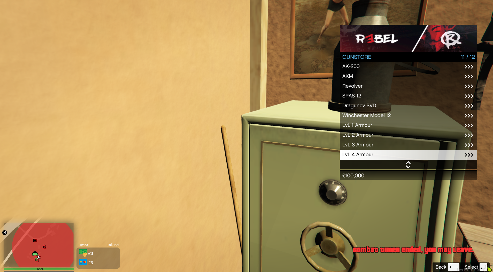
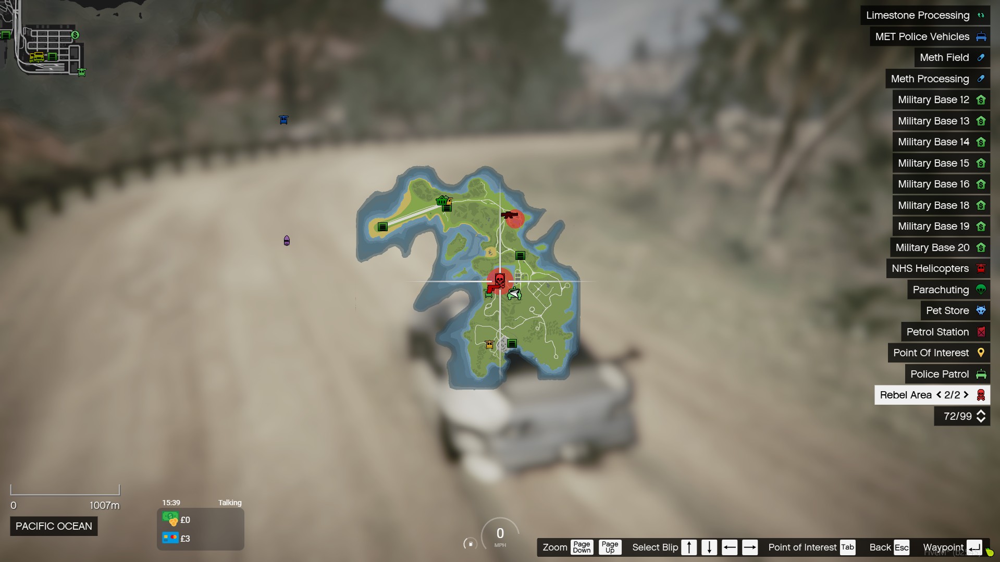
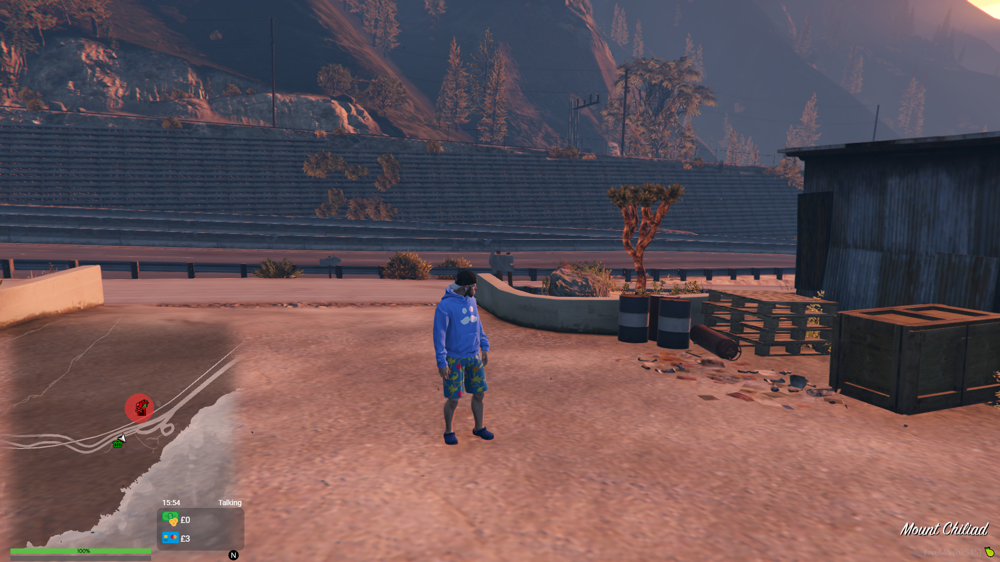

# Rebel

## License Cost: <mark style="color:blue;">£30,000,000</mark>

### Rebel gun shop location 1:

<figure><figcaption>
Rebel waypoint location 1
</figcaption></figure>

 

<figure><figcaption>
Rebel area 1
</figcaption></figure>

### Rebel gun shop:

Once purchasing the rebel license, you can access to multiple perks, like the gun / armor shop where it also allows you to buy full armor and scoped snipers.

<figure><figcaption>
Outside of the gun shop
</figcaption></figure>

 

<figure><figcaption>
Inside of the gun shop
</figcaption></figure>

### Rebel gun shop location 2:

<figure><figcaption>
Rebel waypoint location 2
</figcaption></figure>

 

<figure><figcaption>
Rebel area 2
</figcaption></figure>

### Rebel respawn:

Along with owning rebel, you gain access to a new respawn location, being at the rebel gun shop location 1.

<figure><figcaption>
Rebel  respawn menu
</figcaption></figure>

 

<figure><figcaption>
Rebel respawn location
</figcaption></figure>

